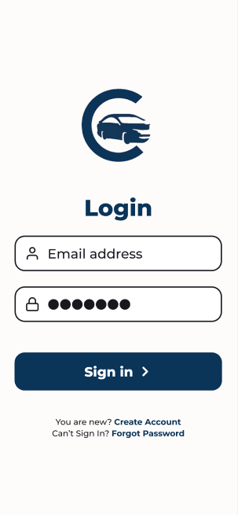
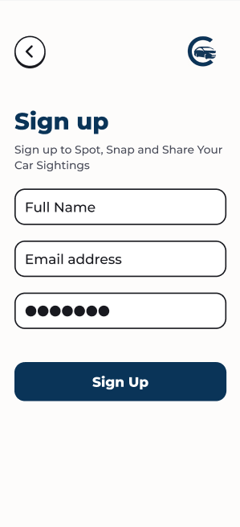
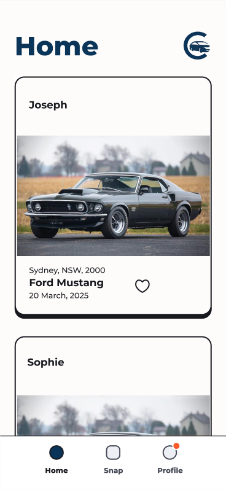
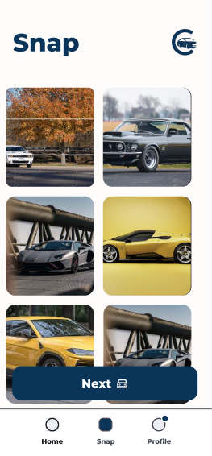
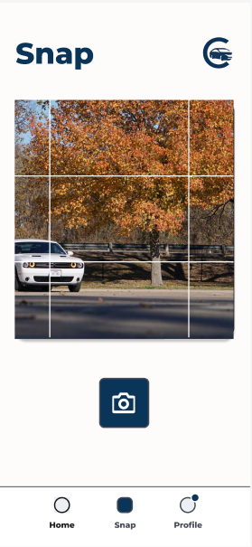
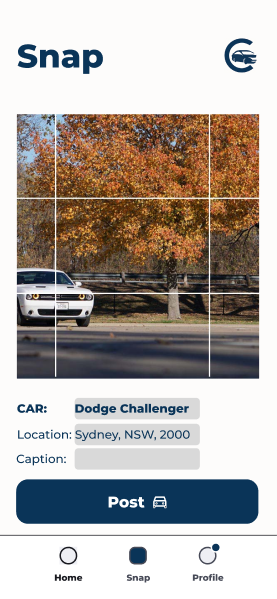
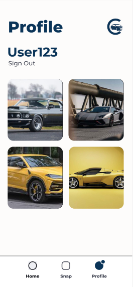
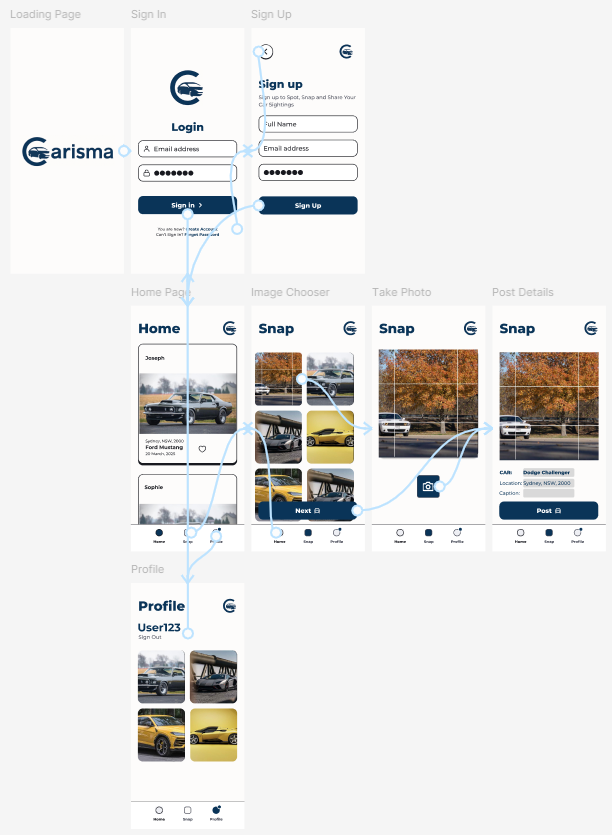

# Introducing 
### Spot, Snap and Share Your Car Sightings

## About Carisma
Carisma is a dynamic mobile app that allows car enthusiasts to capture, share, and discover photos and videos of unique cars spotted in everyday life. Whether it’s a rare classic, an exotic sports car, or a customised masterpiece, Carisma gives users an easy and interactive platform to document the vehicles they encounter. The app fosters a passionate community of car lovers, encouraging users to share their car sightings, interact with fellow enthusiasts, and explore the wide world of automotive culture, all from the convenience of their phones. 

Designed for users aged 13 and older, Carisma enables anyone to create an account by registering with their email and choosing a username. Once signed up, users can upload their car sightings, tagging them with relevant details and sharing them with followers or a specific group of car lovers. Carisma also allows users to like and comment, promoting engagement and building a sense of community. Whether discovering rare vehicles or connecting with likeminded enthusiasts, Carisma is the perfect app for anyone eager to immerse themselves in the world of cars.

## Why We Built This App
Carisma was created to provide a space where car enthusiasts can easily connect, share and most importantly discover the cars that really spark their passion. For too long, car fans have been posting photos of amazing vehicles to their social media stories, only to receive a handful of likes or comments from people that confused a Toyota GR86 with a Subaru BRZ. These interactions left enthusiasts without a platform to truly share their excitement with likeminded individuals.

Competition analysis reveals that while apps such as "Car Spotting App" exist, they often lack intuitive UX, or a social engagement element. We built Carisma to fill this gap by offering a platform where you can share your excitement with others who truly appreciate it. Our goal is to build a vibrant and constantly growing community of car lovers.  

## How Users Will Use the App
The most common flow we anticipate users will take on the app is:
1. They will initially create their user profile
2. After logging in, they will be able to view the car feed and search for users/cars/communities
3. Users will be able to like and comment on public posts
4. If a user sees a car that they are excited to share, they can either take a photo on their phone's camera app, then upload it to Carisma or use the inbuilt camera to capture the car.
5. Users can then add a caption, log the location of the sighting, add a car make and model and any other information and share to the community. 

## Main Features
Carisma's main features are:
* **Photo and Video Sharing**: Users can capture and upload photos and videos of cars that they encounter. These discoveries can then be shared with the Carisma community or with a selected group of friends or followers
* **User Profile**: Create your profile where you can display your favourite captured cars.
* **Interactive Social Features**: Users can like and comment on car sightings from other users on Carisma. Furthermore, they can engage with fellow car enthusiasts through interactions and build online connections with likeminded users.
* **Car Discovery Feed**: Explore a feed of car sightings from other users and communities.  
* **Access Controls**: Users can share their posts to the whole community or with specific groups of friends.
* **Search**: Users can search for cars by their make and model.  
* **Location Services**: Log the location of the car sighting.

Carisma is a constantly growing app, and we aim to continuously enhance the features that we provide to our users. 

## Target Users
The following are the different user groups that we believe will be using Carisma and will aim to target via our marketing strategy:
* **Car Enthusiasts**: These are all users who are passionate about unique cars and are looking to share and view car sitings. 
* **Casual Users**: These are users who occasionally spot interesting cars and what to keep a log of their finds.
* **Photographers**: These are users who are photographers (especially within the car environment) and want to document and showcase their portfolio.
* **Collectors & Historians**: These are users interested in vintage cars and want to track the rarer finds.
* **Car owners looking for inspiration**: These are current car owners who are seeking inspiration for the next modification to their current car.
* **Car Show Organisers**: These are users who are organisers of car shows that want to use the platform to promote their shows
* **Users in the market for a new car**: These are users who are in the market for a new car and want to gain inspiration before they choose the model
* **Car Brands**: These are users from the car brands themselves who want to use the platform to track the popularity of their models

### User Personas
The following are the different user personas we believe will be using Carisma:

**Alex - An Avid Car enthusiast**
* Is 25 years old and Erives a modified Subaru WRX
* His favourite cars are from the Japanese market and wants to own a Nissan GTR
* He loves to attend car meets and take pictures of all cars present
* He then uses Carisma to document any rare Japanese finds and post them to the community
* He uses Carisma to locate more Nissan GTR and Subaru WRX photos

**Sophie - The Casual User**
* Is 30 years old and works in marketing in Sydney
* She drives a Tesla and has no intention on buying a unique car
* She occasionally spots vintage cars at her local cafe
* She uses the app to record these vintage cars and share it with her brother who lives in Melbourne

**James - The Photographer**
* Is 22 years old and is a professional photographer with a focus on super cars
* Travels to different cities to photograph rare cars
* Uses Carisma to showcase his work and get engagement from car enthusiasts

**Richard - The Historian**
* Is 60 years old and has 2 vintage cars built in the 1920s
* Uses the app to take pictures of his own cars and showcase it to the community
* Is active on Carisma and responds to comments of fans asking questions

**Edward - The Car Show Organiser**
* Is 30 years old and runs a local car show in Mona Vale
* Uses Carisma to comment on posts inviting users to his car show
* Ensures that people at the car show document their finds and tag the location to promote his car show

## App Wireframes

The following wireframs will provide users with a better understanding of how to interact with the app.

**Loading Screen**
* The following screen will display for users whilst they wait for the app to load

**Sign In Screen**
* Users can login to their account by typing their email and password combination
* After a user types out the correct credentials and selects "Sign In," they will be directed to the **Home** page
* If the user does not have an account, they can create one by selecting "Create Account" This will direct them to the **Sign Up** page

**Sign Up Screen**
* Users can create their account by typing their name, email and password
* After typing the details and selecting "Sign Up" the user will be directed to the **Home** page
* If the user has an account, they can select the Back button and will be directed to the **Sign In** page

**Home Screen**
* Displays a feed of car sightings with user uploaded photos and likes
* Users can like the posts that they see on their feed
* Users can navigate to the **Snap** and **Profile** page by the toolbar on the bottom

**Snap Page**: 
* Brings up the option for the user to select the camera (Top Left Square) or to choose from their libary
* If the user decides to choose from their library then they can scroll down and pick an appropriate photo. Once they have selected one they select the Next button and are directed to the **Car Post Page**
* If the user decides to take the photo with the camera then they are directed to the **Take Photo Page**

**Take Photo Page**
* The camera opens and the user can take the photo by clicking on the camera button. Once the photo has been taken the user is directed to the **Car Post Page**

**Car Post Page**
* The user can type in the Car and Model name, Location and a caption
* Once they are happy with the photo and the relevant details they select the Post button to share 

**User Profile Screen**
* The user will be able to view their posts and sign out
* The sign out option will take them back to the **Sign In Screen**

The following image displays the entire app flow in one screenshot:

## Minimum Viable Product 
MVP1 will aim to include the following core features:
* Ability for users to sign-in and sign-up via their email
* Ability for users to upload their car sightings and include car details and the location
* Ability for users to view and browse car sightings
* Ability for users to like user snaps
* User profiles with basic features

## Future Roadmap
Post-MVP1, Carisma can expand in various ways:
* **Gamification**: Introduce a gamification aspect and allow users to earn points, badges and create leaderboards for top contributions
* **Improved Profile Settings**: Build upon MVP1 to allow users to create profile pictures and more
* **Improved UI/UX**: Build upon MVP1 to enhance the UI and UX of Carisma
* **Commenting and Sharing**: Allow users to comment on and share posts
* **Event-page**: A section where users can create public events for upcoming car meets and auto shows
* **AI-powered Image Recognition**: Automatically detect car make and model from uploaded photos
* **Sponsored Ads**: Allow car shows, brands and users to run ads
* **Carisma Events & Meetups**: Use the Carisma brand to organise real world meetups and virtual events for users
* **International Inclusion**: Support multi-language capabilities
* **Social Media Sharing**: Allow users to easily share their Carisma spots to Instagram, Tiktok, X and Facebook

## Conclusion
Carisma is designed to be an intuitive, community driven platform for car lovers and casual users alike. It provides a fun way to document and share automotive discoveries. The MVP will focus on the core functionalities while laying the groundwork for potential expansions in future versions.